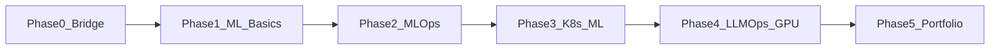
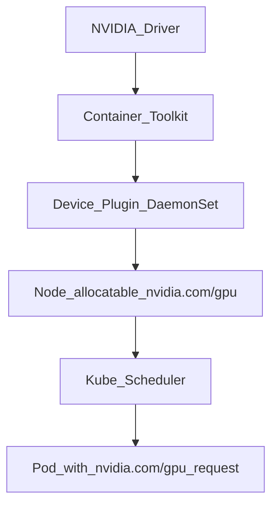

# AI Platform Engineering Roadmap

> **For:** DevOps Engineers · Platform Engineers · SREs · SysAdmins with container experience  
> **Goal:** Level up from infrastructure/platform work into **AI Platform Engineering** (MLOps + LLMOps)  
> **Style:** Free-first learning, KodeKloud as primary hands-on platform  
> **Default pace:** ~3 hours/week → **18–24 months** · Faster pace (~8–10 h/week) → **9–12 months**

This is **not** a beginner IT path and **not** an ML researcher path. You already ship systems; you will learn to ship **ML/LLM platforms**.

---

## Table of contents

1. [Who this is for](#who-this-is-for)
2. [What an AI Platform Engineer does](#what-an-ai-platform-engineer-does)
3. [Prerequisites checklist](#prerequisites-checklist)
4. [Skills you already have → reuse map](#skills-you-already-have--reuse-map)
5. [Career gaps to close](#career-gaps-to-close)
6. [Learning path overview](#learning-path-overview)
7. [Phase 0 — Bridge](#phase-0--bridge-months-12)
8. [Phase 1 — ML literacy](#phase-1--ml-literacy-for-platform-engineers-months-24)
9. [Phase 2 — Core MLOps](#phase-2--core-mlops-months-412)
10. [Phase 3 — Kubernetes as an ML platform](#phase-3--kubernetes-as-an-ml-platform-months-1015)
11. [Phase 4 — LLMOps, GPUs & scheduling](#phase-4--llmops-ai-infrastructure--gpu-scheduling-months-1420)
12. [Phase 5 — Portfolio & job packaging](#phase-5--portfolio--career-packaging-months-1824)
13. [Weekly habit](#weekly-habit)
14. [What to skip](#what-to-skip-at-low-weekly-hours)
15. [Success milestones](#success-milestones)
16. [Resource index](#resource-index)
17. [How to use this repo](#how-to-use-this-repo)

---

## Who this is for

You will get the most from this roadmap if you already work with most of:

- Linux servers and networking basics
- Docker (and ideally some Kubernetes)
- CI/CD (Jenkins, GitLab CI, GitHub Actions, etc.)
- Observability (Prometheus, Grafana, ELK, or similar)
- IaC / config management (Terraform, Ansible, …)
- Scripting (Bash and some Python)

If Kubernetes is still new, spend extra time in Phase 0 — do not skip it.

---

## What an AI Platform Engineer does

You build and operate the **shared platform** that ML/AI teams use:

| Domain | Examples |
|--------|----------|
| **MLOps** | Data/model versioning, experiment tracking, training pipelines, model registry, drift monitoring |
| **Serving** | FastAPI/BentoML/KServe, canary & rollback, SLOs |
| **LLMOps** | vLLM / model servers, RAG infra, vector DBs, LLM gateways, token/cost controls |
| **GPU platform** | NVIDIA GPU Operator, `nvidia.com/gpu` scheduling, MIG / time-slicing, quotas |
| **Platform engineering** | Helm/GitOps, multi-tenant namespaces, security, FinOps |

You are the bridge between **data scientists / ML engineers** and **production infrastructure**.

---

## Prerequisites checklist

Mark what you already know. Gaps in Phase 0 are normal.

- [ ] Linux administration (SSH, systemd, networking, disk)
- [ ] Git + pull requests
- [ ] Docker images, volumes, Compose
- [ ] Kubernetes: Pod, Deployment, Service, Ingress (basic)
- [ ] At least one CI/CD tool
- [ ] Prometheus/Grafana or equivalent metrics
- [ ] Terraform or Ansible (basics)
- [ ] Python: venv, pip, reading simple scripts

---

## Skills you already have → reuse map

| You know (DevOps / Platform) | Reuse for AI Platform |
|------------------------------|------------------------|
| Linux, networking, hardening | GPU nodes, drivers, secure model endpoints |
| Prometheus / Grafana / ELK | Model latency, drift, GPU util (DCGM) |
| Terraform / Ansible | GPU clusters, MLflow/MinIO backends |
| Jenkins / GitLab / GitHub Actions | Model CI, image promote, GitOps triggers |
| Docker / Kubernetes | Training Jobs, InferenceServices, GPU pods |
| Bash / Python | Glue code, small APIs, automation |
| Cloud (AWS / Azure / GCP) | Later: one managed AI skim (SageMaker / Azure ML / Vertex) |
| IAM / RBAC / firewalls | AI secrets, NetworkPolicy, tenant isolation |

---

## Career gaps to close

Typical job postings expect these on top of classic DevOps. They are woven into Phases 2–5 (not a separate track).

| Gap | Why it matters | Where |
|-----|----------------|-------|
| Helm / Kustomize | Ship GPU Operator, KServe, MLflow as packages | Phase 3 |
| Object storage + model cache | Datasets/models in S3/MinIO; PVC caches | Phase 2–3 |
| AI security | HF tokens, NetworkPolicy, RBAC, PII in RAG | Phase 4 |
| GPU FinOps / quotas | GPUs are expensive; fair share across teams | Phase 4 |
| LLM gateway | Auth, rate limits, routing, fallback, token cost | Phase 4 |
| Model SRE | Canary, rollback, latency SLOs, runbooks | Phase 3–5 |
| One cloud AI skim | Job keywords (pick one vendor) | Phase 5 |
| Design docs | Platform serves other teams | Every phase |

**Low ROI early (skip until employed on a GPU team):** multi-node NCCL/RDMA, custom K8s controllers, deep Spark/Flink, agent frameworks, confidential computing.

---

## Learning path overview



| Phase | Focus | ~3 h/week | ~8–10 h/week |
|-------|--------|-----------|--------------|
| 0 | Docker / K8s / Python glue | Mo 1–2 | Weeks 1–3 |
| 1 | ML vocabulary for platform people | Mo 2–4 | Mo 1–2 |
| 2 | Hands-on MLOps (KodeKloud 100 Days) | Mo 4–12 | Mo 2–5 |
| 3 | Helm, GitOps, KServe, artifacts | Mo 10–15 | Mo 4–7 |
| 4 | LLMOps, GPU scheduling, gateway, security | Mo 14–20 | Mo 6–9 |
| 5 | Portfolio + LinkedIn / interviews | Mo 18–24 | Mo 9–12 |

**Pace tip:** Prefer **3× 1-hour sessions** over one long block. KodeKloud free **100 Days of MLOps** unlocks the next task the **next calendar day** after you finish one — so studying on 3 separate days/week fits well.

---

## Phase 0 — Bridge (Months 1–2)

**Goal:** Confirm containers, Kubernetes, and Python so MLOps labs do not stall.

### Learn

**KodeKloud / free**

- [Docker for the Absolute Beginner](https://kodekloud.com/courses/docker-for-the-absolute-beginner) (skip what you know; re-do labs)
- [Kubernetes for Absolute Beginners](https://kodekloud.com/courses/kubernetes-for-the-absolute-beginners-hands-on)
- Optional: [Crash Course: AI-Powered DevOps](https://kodekloud.com/free-courses) · [Free courses hub](https://kodekloud.com/free-courses)

**Other free**

- Python: [docs.python.org tutorial](https://docs.python.org/3/tutorial/) or [freeCodeCamp Python for Everybody](https://www.freecodecamp.org/news/python-for-everybody/) — focus on **venv, pip, requests, pathlib, typing**
- [FastAPI tutorial](https://fastapi.tiangolo.com/tutorial/)

### Exit criteria

- [ ] FastAPI “hello” app running with Docker Compose
- [ ] Explain Pod / Deployment / Service without notes

---

## Phase 1 — ML literacy for platform engineers (Months 2–4)

**Goal:** Enough ML to design platforms and talk to data scientists — **not** become an ML researcher.

### Learn

- [Google Machine Learning Crash Course](https://developers.google.com/machine-learning/crash-course) (concepts; skim heavy math)
- [Hugging Face LLM Course](https://huggingface.co/learn/llm-course/chapter1/1) — Chapters 1–2 at a high level
- KodeKloud [AI Learning Path](https://kodekloud.com/learning-path/ai) — Prompt Engineering 101, local LLMs / Ollama when available

### Concepts checklist

- [ ] Train vs inference
- [ ] Dataset / model / artifact
- [ ] Metrics & overfitting (intuition)
- [ ] Batch vs online serving
- [ ] Why GPUs matter for LLMs

### Exit criteria

- [ ] One-page diagram: registry, store, orchestrator, serving, monitoring

---

## Phase 2 — Core MLOps (Months 4–12)

**Primary:** [100 Days of MLOps Challenge](https://kodekloud.com/100-days-of-mlops) — **free**, real tools, auto-validated labs.

**Stack you will touch:** DVC · MLflow · Feast · FastAPI / BentoML · Evidently · Argo / Prefect · Kubernetes · CI/CD · monitoring

### Weekly habit (example at 3 h/week)

| Session | Focus |
|---------|--------|
| A (1h) | Complete 1 unlocked KodeKloud task |
| B (1h) | Next unlocked task (another day) |
| C (1h) | Notes → GitHub README (“what broke, what I fixed”) |

### Map DevOps skills → MLOps

- CI/CD → model build & promote pipelines
- Prometheus/Grafana → drift + latency dashboards
- Terraform/Ansible → MLflow / Feast backends later

### Career add-on (~1–2 hours)

- Artifact storage: local disk vs [MinIO](https://min.io/docs/minio/linux/index.html) / S3
- Note in your repo: *MLflow artifact store → object storage*

### Exit criteria

- [ ] 100 Days badge (or near-complete) + public notes repo
- [ ] Three architecture diagrams of the MLOps stack

---

## Phase 3 — Kubernetes as an ML platform (Months 10–15)

**Goal:** Move from “K8s for apps” to “K8s for models,” packaged the way production teams ship platforms.

### Learn

- [CKA Learning Path](https://kodekloud.com/learning-path/cka) — exam optional; depth mandatory
- [Helm for Beginners](https://kodekloud.com/courses/helm-for-beginners) or [Helm docs](https://helm.sh/docs/)
- [Kubeflow course](https://kodekloud.com/courses/kubeflow) — pipelines, **KServe**, Katib

### Practice

- [KServe](https://kserve.github.io/website/)
- [Argo Workflows](https://argo-workflows.readthedocs.io/) for training Jobs
- GitOps (Argo CD / Flux): deploy an InferenceService
- Storage: PVC model cache + MinIO or S3 for artifacts
- Model SRE: canary / traffic split + a short rollback runbook

### Exit criteria

- [ ] GitOps-managed model endpoint (Helm or Kustomize + Argo CD)
- [ ] Health checks, resource requests/limits, documented rollback

---

## Phase 4 — LLMOps, AI infrastructure & GPU scheduling (Months 14–20)

**Goal:** The differentiator for AI Platform roles — inference platforms, GPUs, cost, and security.

### Learn

- [AI Infrastructure: LLM-D, vLLM and GPUs](https://kodekloud.com/courses/ai-infrastructure-llm-d-vllm-and-gpus)
- RAG / context modules from [AI Learning Path](https://kodekloud.com/learning-path/ai)
- [vLLM on Kubernetes](https://docs.vllm.ai/en/latest/deployment/k8s/)
- Vector DB: [Qdrant quickstart](https://qdrant.tech/documentation/quickstart/)
- GPU metrics: [DCGM Exporter](https://docs.nvidia.com/datacenter/cloud-native/gpu-telemetry/latest/dcgm-exporter.html) → Prometheus/Grafana

---

### GPU scheduling (core skill)

Kubernetes does **not** see GPUs until NVIDIA software advertises them:



**1. Advertise GPUs**

- Prefer [NVIDIA GPU Operator](https://docs.nvidia.com/datacenter/cloud-native/gpu-operator/latest/index.html)
- Or [k8s-device-plugin](https://github.com/NVIDIA/k8s-device-plugin) + drivers
- Device plugin DaemonSet → node allocatable `nvidia.com/gpu`

**2. Request GPUs in Pods**

```yaml
resources:
  limits:
    nvidia.com/gpu: "1"
  requests:
    nvidia.com/gpu: "1"
```

- GPU requests/limits are usually equal (whole GPUs unless sharing modes)
- No free GPU → Pod **Pending** (same idea as insufficient CPU)

**3. Place pods on the right nodes**

- Node selectors / affinity (e.g. GPU product labels)
- Taints on GPU nodes so normal apps stay off them; inference pods tolerate the taint
- GPU Feature Discovery labels: product, memory, CUDA version

**4. Sharing one physical GPU**

| Mode | Isolation | When to use | Docs |
|------|-----------|-------------|------|
| Exclusive (default) | Full GPU per pod | Production LLM serving (vLLM) | Default `nvidia.com/gpu: 1` |
| MIG | Hardware memory + fault isolation | A100/H100 shared by smaller jobs | [GPU Operator MIG](https://docs.nvidia.com/datacenter/cloud-native/gpu-operator/latest/gpu-operator-mig.html) |
| Time-slicing | No memory isolation | Dev/test, light inference | [GPU time-slicing](https://docs.nvidia.com/datacenter/cloud-native/gpu-operator/latest/gpu-sharing.html) |

**5. Multi-GPU for one model**

- vLLM `--tensor-parallel-size` → request `nvidia.com/gpu: N` on **one node**
- Multi-node inference → learn later (llm-d / LeaderWorkerSet)

**6. Ops checks**

- `kubectl describe node` → Allocatable `nvidia.com/gpu`
- Pending: `Insufficient nvidia.com/gpu`
- DCGM → Grafana for util / memory

**Suggested study order (~8–12 hours)**

1. KodeKloud AI Infrastructure (vLLM / GPUs)
2. NVIDIA GPU Operator overview
3. Time-slicing + MIG docs
4. vLLM K8s guide — explain every field of the GPU resource block in your notes

---

### Career add-ons (high interview value)

**AI security (~4–6 hours)**

- Secrets for HF tokens / API keys (never in images)
- NetworkPolicy: only the gateway reaches model pods
- RBAC: separate namespaces for training vs serving
- RAG: do not index secrets/PII without controls

**LLM gateway + FinOps lite (~4–6 hours)**

- Pattern: clients → **gateway** (auth, rate limit, routing, fallback) → vLLM / cloud LLM
- Practice: [LiteLLM](https://docs.litellm.ai/) or any OpenAI-compatible proxy
- Track tokens, latency, approximate $/1k tokens
- Skim [Kueue](https://kueue.sigs.k8s.io/) — know the problem it solves (fair-share GPU queues)

### Exit criteria

- [ ] Design doc: “How I schedule vLLM on K8s” (device plugin, resources, taints, Pending, MIG vs time-slice, gateway, security, cost)
- [ ] Small RAG or local LLM demo (CPU/Ollama is fine before real GPUs)

---

## Phase 5 — Portfolio & career packaging (Months 18–24)

### Three projects (quality over quantity)

1. **MLOps mini-platform** — DVC + MLflow (+ MinIO/S3) + FastAPI + Evidently + GitHub Actions  
2. **K8s model serve** — Helm/Kustomize + KServe (or Deployment) + Ingress + Grafana SLO + rollback runbook  
3. **LLM platform slice** — Ollama/vLLM + RAG (Qdrant) + LLM gateway + Compose, plus a K8s production design (GPU + security + cost)

### One cloud AI skim (pick ONE)

- [AWS AI Practitioner](https://aws.amazon.com/certification/certified-ai-practitioner/) / free AWS AI digital training, **or**
- [Azure AI-900](https://learn.microsoft.com/en-us/credentials/certifications/azure-ai-fundamentals/), **or**
- GCP Vertex AI intro docs  

Purpose: job-keyword fluency — not deep vendor lock-in.

### Career packaging

- Headline idea: `DevOps / Platform Engineer → AI Platform (MLOps · LLMOps · GPU on K8s)`
- Pin MLOps badge + project repos on LinkedIn/GitHub profile
- Frame existing security/network certs as **AI infra strength**, not your only story
- Prepare **3 interview stories**: (1) CI/CD for models, (2) GPU Pending / scheduling, (3) rollback or cost control

### Optional certs (later)

- CKA (validates K8s depth)
- AI-900 or AWS AI Practitioner (if market asks)

### Exit criteria

- [ ] Three public projects with clear READMEs
- [ ] LinkedIn/GitHub story aligned to AI Platform roles
- [ ] Comfortable explaining GPU scheduling and MLOps stack end-to-end

---

## Weekly habit

| Day | ~60 minutes |
|-----|-------------|
| 1 | KodeKloud lab / 100 Days task |
| 2 | Next task **or** Kubeflow / vLLM / GPU docs |
| 3 | Write notes + push to portfolio repo |

Rule: finish something tangible every week. Notes beat perfect theory.

---

## What to skip (at low weekly hours)

- Deep ML math and research papers
- Every cloud vendor’s AI console
- Building your own training framework or custom controllers
- Multi-node GPU RDMA / NCCL deep dives
- Agent frameworks / confidential computing
- Collecting certs before you have projects

---

## Success milestones

| When | Target |
|------|--------|
| Month 6 | ML vocabulary solid; 20–40 MLOps tasks done |
| Month 12 | 100 Days MLOps done (or near); notes repo live |
| Month 18 | GitOps model serve + LLM/RAG + GPU scheduling + gateway/security notes |
| Month 24 | Three portfolio projects + cloud skim + interview-ready stories |

Compress timelines if you study 8–10+ hours/week.

---

## Resource index

### KodeKloud

- [100 Days of MLOps](https://kodekloud.com/100-days-of-mlops)
- [Free courses](https://kodekloud.com/free-courses)
- [AI Learning Path](https://kodekloud.com/learning-path/ai)
- [AI Infrastructure: LLM-D, vLLM and GPUs](https://kodekloud.com/courses/ai-infrastructure-llm-d-vllm-and-gpus)
- [Kubeflow](https://kodekloud.com/courses/kubeflow)
- [CKA Learning Path](https://kodekloud.com/learning-path/cka)
- [Docker Absolute Beginner](https://kodekloud.com/courses/docker-for-the-absolute-beginner)
- [Kubernetes Absolute Beginners](https://kodekloud.com/courses/kubernetes-for-the-absolute-beginners-hands-on)
- [Helm for Beginners](https://kodekloud.com/courses/helm-for-beginners)

### ML / LLM foundations

- [Google ML Crash Course](https://developers.google.com/machine-learning/crash-course)
- [Hugging Face LLM Course](https://huggingface.co/learn/llm-course/chapter1/1)
- [FastAPI tutorial](https://fastapi.tiangolo.com/tutorial/)

### GPU scheduling & serving

- [NVIDIA GPU Operator](https://docs.nvidia.com/datacenter/cloud-native/gpu-operator/latest/index.html)
- [GPU time-slicing](https://docs.nvidia.com/datacenter/cloud-native/gpu-operator/latest/gpu-sharing.html)
- [GPU Operator MIG](https://docs.nvidia.com/datacenter/cloud-native/gpu-operator/latest/gpu-operator-mig.html)
- [NVIDIA k8s-device-plugin](https://github.com/NVIDIA/k8s-device-plugin)
- [vLLM on Kubernetes](https://docs.vllm.ai/en/latest/deployment/k8s/)
- [KServe](https://kserve.github.io/website/)
- [DCGM Exporter](https://docs.nvidia.com/datacenter/cloud-native/gpu-telemetry/latest/dcgm-exporter.html)
- [Qdrant quickstart](https://qdrant.tech/documentation/quickstart/)

### Career add-ons

- [Helm docs](https://helm.sh/docs/)
- [MinIO docs](https://min.io/docs/minio/linux/index.html)
- [LiteLLM](https://docs.litellm.ai/)
- [Kueue](https://kueue.sigs.k8s.io/)
- [Azure AI-900](https://learn.microsoft.com/en-us/credentials/certifications/azure-ai-fundamentals/)
- [AWS AI Practitioner](https://aws.amazon.com/certification/certified-ai-practitioner/)

---

## How to use this repo

1. Fork or clone this repository.
2. Create a folder `notes/` and log each study session (date, link, what you broke/fixed).
3. Track progress with the checkboxes above (or GitHub Issues / Projects).
4. Publish Phase 5 projects as separate repos and link them from your profile README.
5. Update LinkedIn when you finish a phase — proof beats titles.

### Suggested progress board

```text
Backlog → Phase 0 → Phase 1 → Phase 2 → Phase 3 → Phase 4 → Phase 5 → Job-ready
```

---

## Contributing

Improvements welcome: better free links, corrected course URLs, extra portfolio ideas, translations. Open a PR with a short “why.”

---

## License

Feel free to use and share this roadmap for learning. If you publish a derived version, a link back is appreciated.

---

**Maintained for the DevOps → AI Platform community.**  
If this helped you, star the repo and share your portfolio link in Discussions.
